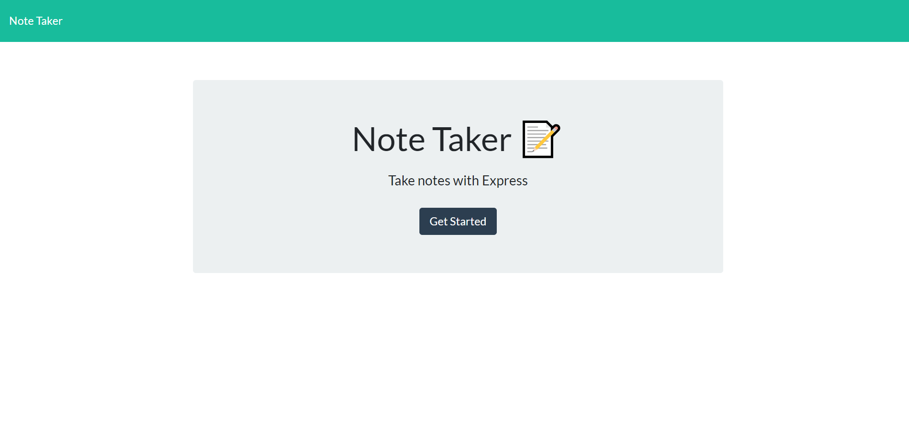
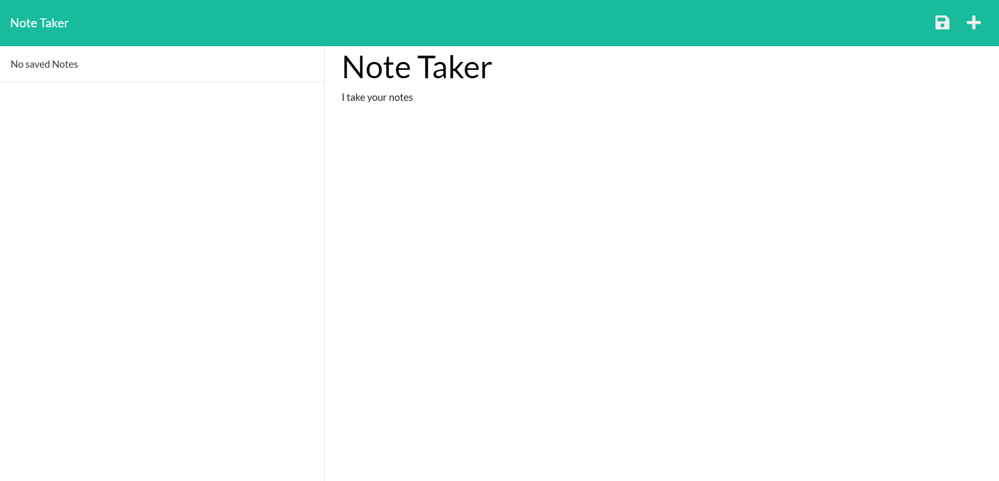
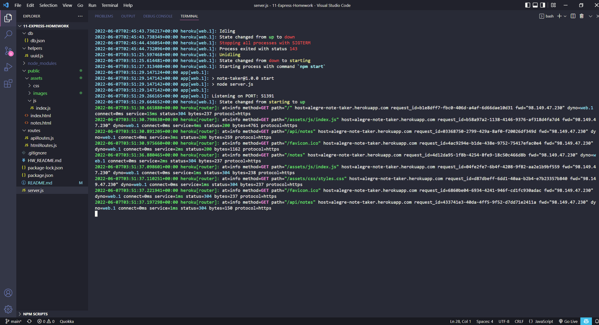

# 11-Express-Homework

## Table of Contents 📑
- [Description](#description)
- [Application Preview](#application-preview)
- [Installation](#installation)
- [Usage](#usage)
- [Links](#links)
- [Criteria](#criteria)
- [Questions](#questions)
- [License](#license)

## Description
Create an application called Note Taker that can be used to write and save notes. This application will use an Express.js back end and will save and retrieve note data from a JSON file. The application’s front end has already been created. It's your job to build the back end, connect the two, and then deploy the entire application to Heroku.

## Application Preview

    

    

    

## Installation
- Copy the repository to your system
- npm install
- node server.js
- Visit http://localhost:3001/ or https://alegre-note-taker.herokuapp.com/

## Usage
To Add a Note:
- Click the '➕' button.
- Enter a Note Title.
- Enter a Note Text
- Click the '💾' button. 

To View a Note:
- Click the Note Title on the left-hand column.
- The clicked Note will display on the right-hand column.

Delete a Note:
- Clicking the '🗑️' button.

## Links
-   Github Repository:
    - https://github.com/brianalegre/11-Express-Homework
-   Heroku Deployed:
    - https://alegre-note-taker.herokuapp.com/

## Criteria
- db.json that will be used to Store and Retrieve the notes
    - Use FS Module
- HTML Routes
    - GET /notes returns notes.html
    - GET * returns index.html
- API Routes
    - GET /api/notes reads/returns db.json
    - POST /api/notes adds to the db.json, then return to client
        - Add a UUID
- Bonus
    - DELETE /api/notes/:id deletes the note by UUID

## Questions
Questions? Concerns?  Contact Me Below:
- Github Username: brianalegre
- Github Link: https://github.com/brianalegre 
- Email: brialegre@yahoo.com

## License
- Copyright 2022 Brian Alegre
- Licensed under the: [MIT License](https://opensource.org/licenses/MIT) 

